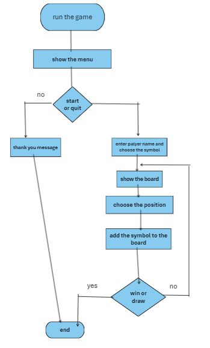
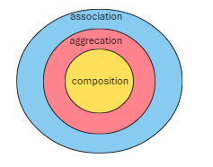

# XO-oop

what we will do in this game?

1. run the app
2. show the main menu
    - start the game
    - quit
3. enter 1st player name and the choosen symbol
4. enter 2nd player name.
5. play the game till one of the players win or draw happen.
6. show another message for restarting the game or quit.

## when player win

- if same symbol where in the same
    1. row
    2. column
    3. diagonal

## how many classes will be in the game?

1. board
2. player
3. start and finish menu (for starting the game or finish)
4. game logic

## what will contain each class

1. player:
    - name: string attribute
    - symbol: string attribute
    - choose_name(): method, its constrain is: only characters
    - choose_symbole(): method, its constrain is: only one character.
    - check_name(): method to check name constrain
    - check_symbol(): method to check symbol constrain

2. board:
    - board: list or 2d array.
    - show_board(): method to display the board for the first time.
    - update_board(): method to display the board after the game start.
    - reset_board(): method to dispaly the baord without any symbols.

3. menu:
    - show_main_menu(): method to display the main menu message.
    - show_finish_menu(): method to display the second menu message to restart or quit the game.

4. game logic:
    - board: object attribute from board class
    - players: object attribute from player class. it will be list.
    - menu: object attribute from menu class
    - current_player_index: integer attribute, show which player turn to play.
    - start_game(): method to show the main menu
    - play(): method to handel the play game and which player start, which player turn.
    - check_win(): method to check if any player win the game.
    - check_draw(): method to check if there is draw.
    - restart_game(): to restart the game if the user choose restart option.
    - quit_game(): to quit the game if the user choose quit option.

## classes relationsships

- association
- agrication
- composition
- inheritance.

for the classes all the ralations are assoiation and composition
